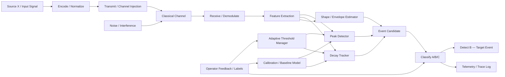
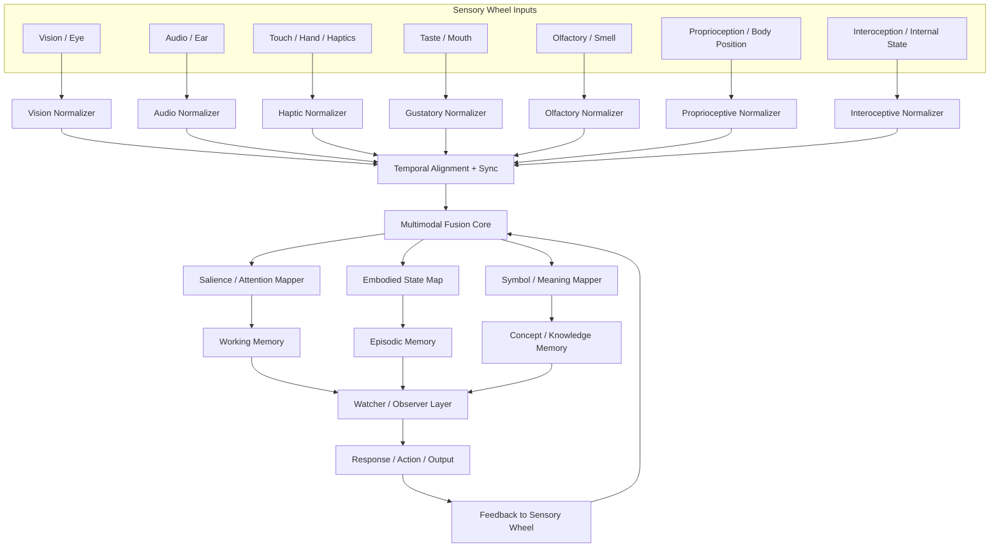
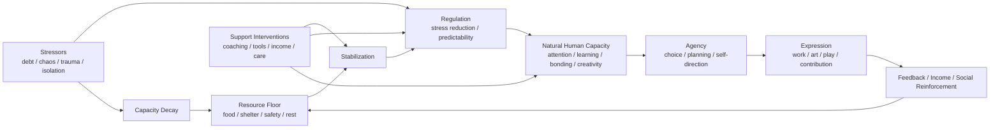
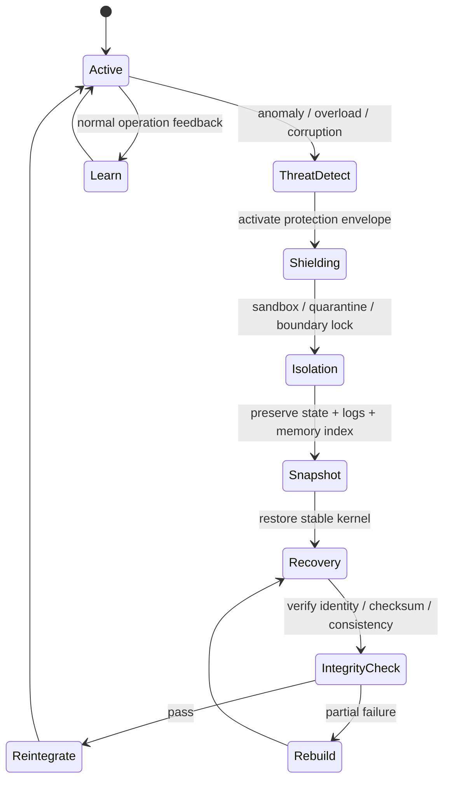
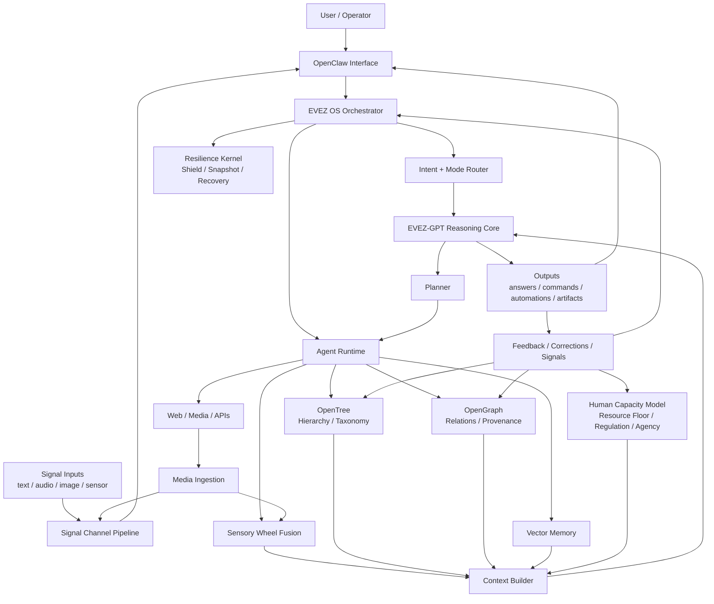
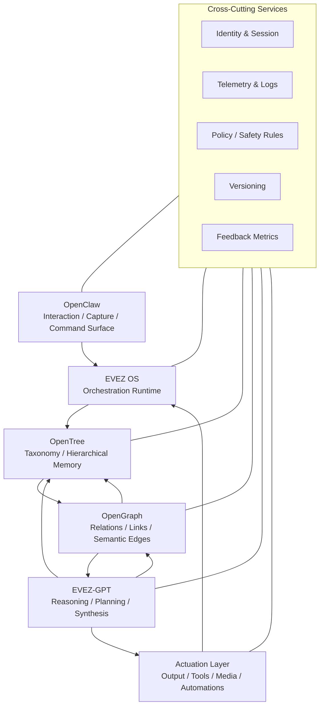
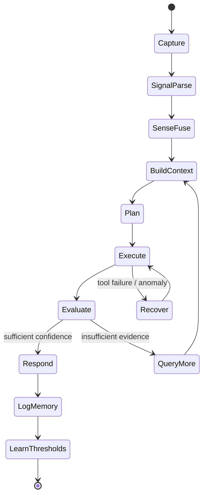

# EVEZ Architecture — Full System Blueprint

**Version:** 1.0  
**Updated:** 2026-02-23  
**Status:** CANONICAL

---

## System Statement

EVEZ is a recursive, closed-loop AI operating stack. It ingests signals from human operators and external media sources, processes them through layered hierarchical and relational memory, routes intent through a reasoning core, and returns outputs that feed back into memory and orchestration. The system includes four cross-cutting subsystems: a signal detection pipeline, an embodied sensory fusion layer, a human capacity state model, and a resilience kernel.

---

## Named Layer Responsibilities

| Layer | Role |
|-------|------|
| **OpenClaw** | Interface/capture/control surface. All human input and signal ingestion enters here. |
| **EVEZ OS** | Orchestration runtime. Intent routing, agent scheduling, job queue, session state. The only control mechanism besides EVEZ-GPT. |
| **OpenTree** | Hierarchical memory/taxonomy. Scope, containment, workflow structure — what *belongs* where. |
| **OpenGraph** | Relationship knowledge graph. Causality, provenance, references — what *points* to what. Tree and Graph must never merge but always converge at retrieval. |
| **EVEZ-GPT** | Reasoning/planning/generation core. Context is assembled externally; GPT does not own its own retrieval. |

### Cross-Cutting Services (all layers)
- Identity & Session
- Telemetry & Logs
- Policy / Safety Rules (incl. OPERATIONAL INVARIANTS — see below)
- Versioning
- Feedback Metrics

---

## Operational Invariants

These must never change under any system load:

1. **Spine is append-only.** No overwrites. Corrections require new dated entries.
2. **truth_plane enforcement.** CANONICAL values are set once per round. No retroactive mutation.
3. **Fire threshold immutability.** `poly_c >= 0.500` is the only fire condition. Not adjustable at runtime.
4. **No plain-text tweet fallback.** If video render fails, no tweet is posted. Silence > noise.
5. **Inline arithmetic is canonical.** When workbench is unavailable, inline computed values carry CANONICAL status if consistent with prior rounds.

These are the falsifier anchors. Without them the architecture is just pipes with no physics.

---

## Subsystem 1: Signal Channel + Peak/Decay Detection Pipeline

> This is the same primitive as the hyperloop fire detector. `poly_c >= 0.500` = `detect_B`. `EvaluateResult → NeedMoreData` = refractory window. The hyperloop IS a signal detection system.



### Runtime Parameters

```json
{
  "baseline_mean": 0.0,
  "baseline_std": 1.0,
  "k": 3.0,
  "peak_threshold": "baseline_mean + k * baseline_std",
  "decay_tau_ms": 500,
  "min_peak_prominence": 0.1,
  "refractory_window_ms": 200,
  "confidence_score": 0.0
}
```

---

## Subsystem 2: Sensory Wheel / Embodied Multimodal Fusion



### Runtime Parameters

```json
{
  "modality_weights": { "vision": 0.3, "audio": 0.3, "haptic": 0.15, "proprioception": 0.15, "interoception": 0.1 },
  "sync_window_ms": 50,
  "sampling_rates": { "vision_hz": 30, "audio_hz": 16000, "haptic_hz": 100 },
  "salience_threshold": 0.4,
  "watcher_buffer_depth": 32
}
```

---

## Subsystem 3: Human Baseline → Natural Human Capacity Loop

> Models the operator's actual state. Feeds CTX alongside Tree, Graph, and Vector. Context is not just data — it includes operator capacity.



### Runtime Parameters

```json
{
  "resource_score": 0.0,
  "regulation_score": 0.0,
  "agency_score": 0.0,
  "capacity_score": 0.0,
  "stressor_weight": 1.0,
  "support_weight": 1.0,
  "decay_rate": 0.05
}
```

---

## Subsystem 4: Resilience Kernel — Recursive Persistence / Shielding / Recovery

> EVEZ-OS already runs this implicitly: inline arithmetic substitutes when workbench dies; probe polling degrades gracefully; loop never halts. This makes it explicit.



### Symbolic → Engineering Translation

| Original (notebook) | Engineering meaning |
|---------------------|--------------------|
| "Outphasing existence" | State isolation / sandboxing |
| "Proper shielding" | Protection envelope / fault containment |
| "Live over and over" | Recovery recurrence / resilience cycle |

### Runtime Parameters

```json
{
  "snapshot_interval_s": 300,
  "integrity_checks": ["sha256_state", "round_monotonic", "V_global_positive"],
  "max_recovery_retries": 3,
  "refractory_after_recovery_s": 60
}
```

---

## Master System Schematic (All Subsystems Integrated)



> **Note on parallelism:** ORCH dispatches into all memory layers simultaneously. The spine diagram is not strictly sequential — it's parallel fanout with late-binding context assembly. CTX waits for quorum, not sequence.

---

## Layered Symbolic Spine



---

## Runtime State Machine



---

## Internal Module Names

| Layer | Module slug |
|-------|------------|
| OpenClaw | `claw-ui` |
| EVEZ OS | `evez-orchestrator` |
| OpenTree | `opentree-store` |
| OpenGraph | `opengraph-db` |
| EVEZ-GPT | `evez-reasoner` |
| Media pipeline | `media-ingest` |
| Context assembly | `context-builder` |
| Feedback | `feedback-engine` |
| Signal detection | `signal-detector` |
| Sensory fusion | `sensory-fuser` |
| Human state | `human-state-model` |
| Resilience | `resilience-kernel` |

---

## OpenTree vs OpenGraph — Rule of Thumb

| OpenTree | OpenGraph |
|----------|-----------|
| Structure, folders, categories, workflows, scope | Relationships, causality, references, provenance |
| What *belongs* where | What *points* to what |
| Document/hierarchy DB (e.g. Postgres + JSON) | Graph DB (e.g. Neo4j, FalkorDB) |
| Session, Task, Artifact, Domain nodes | Entity, Event, Claim, Relationship, Provenance nodes |

They must never merge. They always converge at the Context Indexer.

---

## Diagram Legend

| Shape | Meaning |
|-------|---------|
| Circles | Sources / sensors / humans / entities |
| Rectangles | Processing blocks / modules / transforms |
| Diamonds | Decisions / classification / thresholds |
| Rounded rectangles | Memory / state stores |
| Dashed lines | Feedback / calibration / control signals |
| Bold arrows | Primary data path |
| Thin arrows | Auxiliary / telemetry / metadata |

---

## Minimal Build Order

1. **OpenClaw UI** — text input, output panel, session history
2. **EVEZ OS core** — intent router, planner, tool runner, job queue
3. **Memory** — Postgres (sessions/tasks), vector DB, graph DB; simulate OpenTree in JSON first
4. **Media ingestion** — YouTube URL in → transcript out → chunk + embed + store
5. **Context builder** — merge tree + graph + vector + human_state into prompt context
6. **Feedback loop** — correction capture, memory update rules, threshold learning

---

*EVEZ Architecture v1.0 — append-only. Corrections as new dated entries below.*
