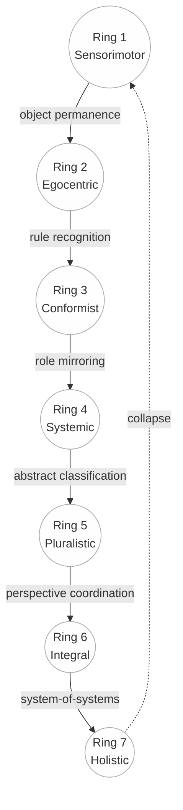

# Hard-Mode Cheatcodes: The Cognitive Debugging Toolkit for Distributed Systems

> *"Hard mode is when the system shows you contradictory mirrors. The cheat is you don't argue with mirrors — you test what layer is producing each reflection."*

---

## The Problem You Already Know

You're debugging. LTE works. Wi-Fi doesn't. Your brain says "server down."

But the server isn't down. *Reality is split.* Two truths exist simultaneously until you force collapse.

That moment — where multiple explanations all look true because the system is distributed and delayed — is an **entanglement cognitive event**. Your brain wants relief. It grabs the first satisfying story. That's how you lose hard mode.

This toolkit gives you the muscle-memory rules that prevent it.

---

## Part 1: The Cyclical Neural Blueprint

A single integrative schema mapping five major developmental/cognitive frameworks into one circular (re-entrant) model.

### The 7 Rings

| Ring | Piaget | Kohlberg | Loevinger | Kegan | Spiral Dynamics | LCD (Exit Dendrite) |
|------|--------|----------|-----------|-------|-----------------|-------------------|
| 1 | Sensorimotor | Pre-moral | Impulsive (E2) | Order 0 | Beige | Object permanence — distinguish signal from void |
| 2 | Pre-operational | Obedience (S1) | Self-protective (E3) | Order 1 | Purple | Rule recognition — pattern-lock "if X then Y" |
| 3 | Concrete-operational | Reciprocity/Conformity (S2-3) | Conformist (E4) | Order 2 | Red↔Blue | Role mirroring — encode "I" vs "others," swap views |
| 4 | Formal-operational | Law-and-Order (S4) | Self-aware (E5) | Order 3 | Orange | Abstract classification — bind categories independent of examples |
| 5 | Post-formal | Social-contract (S5) | Conscientious (E6) | Order 4 | Green | Perspective coordination — model multiple truths simultaneously |
| 6 | Meta-systemic | Universal ethics (S6) | Individualistic (E7) | Order 4/5 bridge | Yellow | System-of-systems — feedback about feedback |
| 7 | Holistic/Non-dual | — | Autonomous/Integrated (E8+) | Order 5 | Turquoise | Non-dual binding — awareness observes itself |

### Reading the Wheel

- **Clockwise** = maturation (adding a new class of mental objects)
- **Rollover**: at each boundary, the new LCD is the smallest neural structure that must form
- **Counter-clockwise** = regression or simulation (systems can simulate higher rings without housing the dendrite)
- **The dashed arrow from Ring 7 → Ring 1** = the re-entrant loop where awareness folds back (non-dual)

### Mermaid Diagram Source

---

## Part 2: The Five Hard-Mode Cheatcodes

Cheatcodes aren't magic hacks. They're muscle-memory rules that keep you from getting mind-fucked by confusing signals.

### CHEATCODE 1: Don't Marry the First Explanation

Your brain wants relief. It grabs the first story that feels satisfying. That's how you lose hard mode.

**The trap:** Premature pattern-lock. You see one signal, construct a narrative, and defend it.

**The cheat:** Hold at least TWO explanations open for the first 60 seconds. If you can't think of a second explanation, you haven't looked hard enough.

**Example:** "The server is down" → ALSO hold: "My DNS is stale" and "The CDN is serving a cached error."

---

### CHEATCODE 2: Separate "What I Saw" from "What's Final"

In distributed systems, the first thing you see is often a rumor (cache, pending state, partial propagation). Final truth arrives late.

**The trap:** Treating the first signal as ground truth.

**The cheat:** Tag every observation with a freshness score. Ask: "Am I seeing the source of truth, or a reflection of it?"

**Example:**
- DNS query returns IP → Is this the authoritative answer or a cached one? Check TTL.
- API returns 200 → Is this from the origin server or a CDN cache? Check headers.
- Database shows value X → Is this committed or in a pending transaction?

---

### CHEATCODE 3: Ask "What Would Prove Me Wrong?"

If you can't answer that question, you're not diagnosing — you're guessing.

**The trap:** Confirmation bias. You look for evidence that supports your theory and ignore contradictions.

**The cheat:** Before you act on a theory, name ONE thing that would disprove it. Then test THAT thing first.

**Example:**
- Theory: "Server is overloaded" → Falsifier: "CPU and memory are normal" → Check CPU first
- Theory: "Network partition" → Falsifier: "Both sides can ping each other" → Test connectivity first
- Theory: "Bad deploy" → Falsifier: "Previous version has the same bug" → Roll back and test

---

### CHEATCODE 4: Split into Layers, Test Layers Separately

If you don't separate layers, you confuse symptoms with causes and everything becomes spooky nonsense.

**The trap:** Testing the whole system at once and hoping the answer reveals itself.

**The cheat:** Pick a layer model and test ONE layer at a time, bottom-up:

| Layer | What to Test | Tool |
|-------|-------------|------|
| Physical/Network | Can packets reach the destination? | ping, traceroute, mtr |
| Naming (DNS) | Does the name resolve to the right IP? | dig, nslookup |
| Transport (TCP/TLS) | Can we establish a connection? | openssl s_client, curl -v |
| Application (HTTP) | Does the app respond correctly? | curl, browser dev tools |
| Caching | Are we seeing stale data? | Cache-Control headers, TTL |

When you find the broken layer, you've found the cause. Everything above it is a symptom.

---

### CHEATCODE 5: Use Two Viewpoints

One probe from one place is never reality. It's a perspective. Two different vantage points collapse half the illusions immediately.

**The trap:** Single-perspective debugging. You only test from your machine.

**The cheat:** Always test from at least TWO locations:
- Your machine AND a different network
- Inside the cluster AND outside
- One DNS resolver AND another
- One browser AND curl

**Example:**
- Site broken on Wi-Fi, works on LTE → Problem is between you and the Wi-Fi resolver, not the server
- API fails from US, works from EU → CDN or regional routing issue
- Works in Chrome, fails in curl → Client-side JavaScript issue, not server

---

## Part 3: The LCD Neuro-Algorithm

A 5-step operational loop for cognitive maturation under stress:

### Step 1: Detect Boundary
Monitor for error signals unexplainable by current mental objects. When your model fails to predict what you observe, you've hit a ring boundary.

### Step 2: Create Proto-Node
Spawn a minimal new encoding for the anomaly. Don't build a theory — just name what you see that doesn't fit.

### Step 3: Binding & Rehearsal
Hebbian strengthening: repeat the new pattern until the proto-node can predict the anomaly reliably.

### Step 4: Graph Re-Compression
Redistribute weights. The old reality becomes a sub-routine of the new one. You didn't lose your old model — it became a special case of your expanded model.

### Step 5: Loop
Repeat when the next anomaly cluster appears. Maturation never ends.

**Key insight:** Maturation ≈ recursive compression of prediction error. Each tier is the smallest neural program that zeroes its current surprise.

---

## Part 4: Bridge Realities — From Neural to Social

| Action | Neural Analogue | Social Practice |
|--------|----------------|-----------------|
| Name the anomaly | Tag unexplained input; spike neuromodulators | Shared language for what nobody can model |
| Model the other's model | Build local copy of their dendrite graph | Double-loop dialogue, active listening |
| Surface tacit rules | Latent-to-symbol mapping; hippocampal recall | Write norms, threat-model them |
| Design sandbox simulations | Hippocampus replay sequences | Role-play, scenario drills, agent-based sims |
| Install feedback metrics | Dopamine/serotonin gating | KPIs that reward higher-tier cooperation |

---

## Part 5: Worked Example — The DNS Split-Brain

### The Scenario
You load a site. On LTE: works. On Wi-Fi: dead.

### Cheatcode 1: Don't Marry "Server Down"
Hold three hypotheses: (a) server down, (b) DNS split, (c) Wi-Fi proxy issue.

### Cheatcode 2: Separate Observation from Reality
"I saw a timeout on Wi-Fi" ≠ "The server is unreachable." The timeout is an observation. The cause is unknown.

### Cheatcode 3: What Proves Me Wrong?
- If server is down: LTE should also fail → LTE works → **server down REFUTED**
- If DNS is split: resolvers return different IPs → **TEST THIS**
- If Wi-Fi proxy: direct IP access should work → **TEST THIS**

### Cheatcode 4: Split into Layers
- Layer 1 (Network): `ping 8.8.8.8` from Wi-Fi → works → network is fine
- Layer 2 (DNS): `dig example.com @wifi-resolver` vs `dig example.com @8.8.8.8` → **DIFFERENT IPs**
- **Root cause found at DNS layer.** Everything above is a symptom.

### Cheatcode 5: Two Viewpoints
- Wi-Fi resolver: returns old IP (cache, TTL not expired)
- LTE resolver: returns new IP (fresher cache or direct authoritative)
- Confirmation: the "two realities" collapse into one explanation: stale DNS cache.

### Resolution
The server was never down. Reality was split between two caching layers with different TTLs. The "entanglement event" was your brain trying to reconcile two contradictory observations into one story before you had enough data.

---

## The Falsifier

If you apply all 5 cheatcodes to your next distributed debugging session and your mean-time-to-root-cause doesn't improve, this framework needs revision. That's the deal — we don't sell certainty, we sell better epistemics.

---

## Author

Steven Crawford-Maggard (EVEZ)  
Security researcher — epistemic agility, failure-surface compression, virtualization forensics

*"The smugger the claim, the richer the failure surface, the more missions it generates."*
